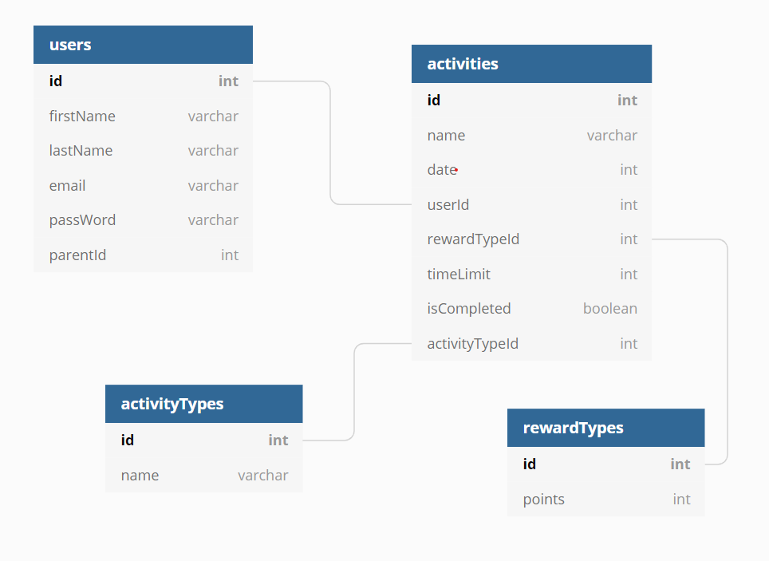

# Suganya-dev.github.io
# Kids ChorePad

**The Productivity app for Kids**

## Application Overview:
I plan to build an application to encourage children to do the tasks by their own without the adult supervision.This App helps parents/adults to track their kids progress in their Academic,and helps to manage their kids time in a very productive way. The primary user of this App is children,and the secondary users will be Adults/parents. This App helps kids to manage,regularize their work by themself. It also motivates the kids to complete their daily tasks and get full rewards/stickers for that day,which can be noticed by parents as well. It minimises the work for parents towards their kids activities.
I built this application in two weeks initially, using React Hooks and CSS for styling. 
My goals were to incorporate full CRUD functionality with many-to-many relationships, gain a deeper understanding of React Hooks, props, and state, while also incorporating an intuitive, functional user interface, without the use of bootstrapped components.

## Features:
- Parent Users can register an email and a password.
- The Parent User can login in to the app(Parents dashboard).
- Parents can register their kids.
- Parents can create chores for their Kids.
- Kids users can log into app(Kids dashboard).
- AfterKids users logging in, they can see the Main page with their    
	Chores or classes  or events  
- After kid Users completed their chores,they will receive a reward points.

## Technologies Used:
 </img>
 </img>
 </img>
 </img>

**Running this Application,First note about authentication**

*This application uses mock authentication which is purely for demonstration purposes. Therefore the login and registration code written here is completely insecure and would never be implemented in a professional application.*

Now that we've cleared that up...

**Make sure you have Node.js and npm installed**

1. git clone repository URL
    git@github.com:Suganya-dev/Frontend-CAPSTONE.git
2. cd into the directory Frontend-capstone
3. touch api/database.json
4. Launch the Client.
        npm install
        npm start
5. touch src/Settings.js
6. In your database.json file, create the following empty arrays: { "users": [],  "activities": [], "activityTypes":[], "rewardTypes":[]} (No External API is used)
7. Serve JSON file utilizing json-server -w database.json -p 8088
8. In a new tab in your terminal, cd into src, and serve
9. Go to the localhost in your browser and register an account

## ERD:

## LOGO:

https://dbdiagram.io/d/5fa30dcc3a78976d7b7a8fb4

Created by Suganya
